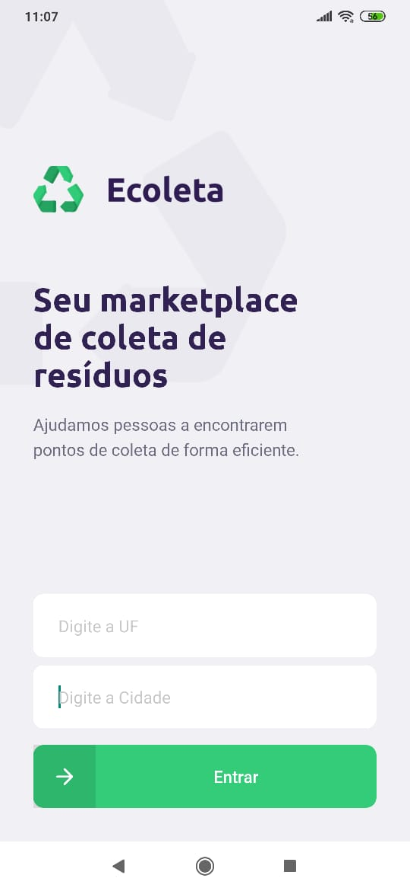
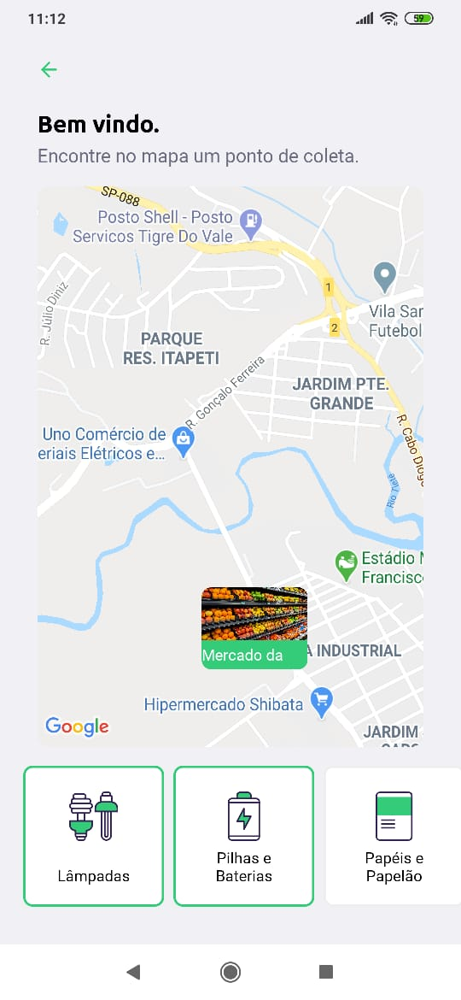
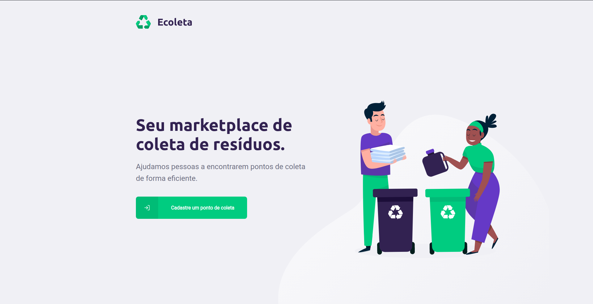

<h1 align="center">
  
</h1>

<h3 align="center">Ecoleta - Aplicação desenvolvida para facilitar o encontro de pontos de coletas.</h3>


<p align="center">



</p>


<p align="center">
  
</p>


## 🚀 Tecnologias

Esse projeto foi desenvolvido com as seguintes tecnologias:

Backend:
- [Node.js](https://nodejs.org/en/)
- [Express](https://expressjs.com/pt-br/)
- [Knex](http://knexjs.org/)
- [sqlite3](https://github.com/mapbox/node-sqlite3)


Frontend:
- [ReactJS](https://pt-br.reactjs.org/)
- [Axios](https://github.com/axios/axios)
- [React icons](https://react-icons.netlify.com/#/)
- [React toastify](https://github.com/fkhadra/react-toastify)
- [React-router-dom](https://www.npmjs.com/package/react-router-dom)
- [React-dropzone](https://react-dropzone.js.org/)
- [Leaflet](https://leafletjs.com/)

Mobile:
- [React Native](https://reactnative.dev/)
- [Expo](https://expo.io/)
- [MailComposer](https://docs.expo.io/versions/latest/sdk/mail-composer/)
- [React Navigation](https://reactnavigation.org/)
- [Axios](https://github.com/axios/axios)

## 💾 Instalação

<h3> Instalação - Backend</h3>

<h4>2. Execute os comandos abaixo</h4>

```bash
# Clone o repositório
$ https://github.com/rodrigosakamoto/Ecoleta.git

# Em seguida execute:

$ cd Ecoleta
$ cd backend

$ yarn

# Rode as migrations
$ yarn knex:migrate

# Rode as seeds
$ yarn knex:seed

$ yarn dev:server
```

<h3> Instalação - Frontend 💻 </h3>

<h4>Execute os comandos abaixo</h4>

```bash
$ cd Ecoleta
$ cd web

# Em seguida execute:

$ yarn

$ yarn start
```


<h3> Instalação - Mobile 📱(Expo) </h3>

<h4>Execute os comandos abaixo</h4>

```bash
$ cd Ecoleta
$ cd mobile

# Em seguida execute:

$ yarn

$ yarn start
```
---
By [Rodrigo Sakamoto](https://www.linkedin.com/in/rodrigo-sakamoto/)